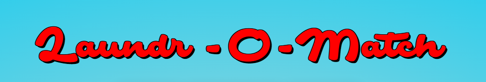

 
A simple memory game based around the usually mundane task of pairing washed socks. Set your difficulty level and challenge yourself to beat the clock or race against friends. It’s just a silly little bit of fun.

https://thequig-lebowski.github.io/oddsock/
 

# Table of Contents

1. [UX](#UX)
	* [Strategy](#Strategy) 
	* [Scope](#Scope)
	* [Structure](#Structure)
	* [Skeleton](#Skeleton)
	* [Surface](#Surface)
	* [User Stories](#User-Stories)
	* [Design](#Design)
2. [Features](#Features)
	* [Existing Features](#Existing-Features)
	* [Future Features](#Future-Features)
3. [Technologies Used](#Technologies-Used)
4. [Testing](#Testing)
	* [Testing User Stories](#Testing-User-Stories) 
	* [Device Testing](#Device-Testing)
	* [Validation](#Validation)
	* [Unit Testing](#Unit-Testing)
	* [Known Bugs](#Known-bugs)
5. [Deployment](#Deployment)
6. [Credits](#Credits)
	* [Code](#Code)
	* [Images](#Images)
	* [Acknowledgements](#Acknowledgments)

  

# UX

## Strategy
The primary objectives of this project are to have fun. This is a simple game that will hopefully engage and provide a bit of entertainment to the user. Played on a larger device such as an ipad, this game could be used to help develop hand eye coordination in young children as well help improve the memory skills of the user of any age.

## Scope
Bright, inviting graphics. Needs to be very intuitive. Card flipping based memory games are not new and therefore have an established gameplay. The user will likely have seen similar games or perhaps played an analogue version before, deviating from the expected workflow would be counterproductive and cause frustration among users, ultimately the exact opposite of what we’re looking for.
To accommodate a wider range of users the game will have multiple levels of difficulty; easy medium, hard and perhaps ‘insane’. Gameplay will be the same through out all of these levels, the only thing changing would be the size of the grid and number of cards on it.

## Structure
As this is not an overly complex concept or game, the visual elements should reflect that. Conesious of mobile users, I decided to have all the buttons above the game board to elemenate accidentally pressing any buttons. Similarily the start game and play again overlay screens were made to be clickable anywhere so any mobile users (especially those on larger devices) wouldn't have to awrkwardly navigate very far.

## Skeleton
Wireframes for the site
* [mobile](/assets/images/AssetsREADME/mobile_mockup.png)
* [desktop.](/assets/images/AssetsREADME/desktop_mockup.png)

There were several changes that were made since the mockups. Most obviously is the name of the site. I pivoted from Odd Sock to Laudr-O-Match halfway through development when I realised the opportunity for a bit of word play.
 
Another main difference was the ommision of some of the extra menu items. I had originally thought about adding a page for how to play the game as well as link but I thought it took away from the playfull nature I was aiming for with the site.
 
An issue that I felt was important to address was making sure that the users would be to tell where they were in the game: as you progress further the more cards you would have flipped over and the more important it was to highlight the last two cards clicked, to help differentiate them from the already flipped pairs of cards on the board.
 

## Surface
Colour Pallete, screen shots, theme

## User Stories
* As a user I want to play a fun game to pass the time
* As a user I want to develop my memory skills and reaction times
* As a user I want my young child to develop their hand-eye coordination 
* As a user I will look for feedback as to weather or not I am using the site/playing the game correctly.
	* Visual cues to let the user know buttons have been clicked
	* Modals when I run out of time/loose
	* Notifications when I win or the game is over
* As the user I want to be able to play the game on my mobile device as well as desktop/laptop

## Design

Keeping with the theme of the laundromat I searched for a font that I felt matched the aesthetic for the main title and settled on Safir Script which I found [here](https://www.fontspace.com/safir-script-font-f24141), at Font Space. As that is quite a busy font I chose something slightly more simple but still complitmented it as the font for the remainder of the site. I landed on [this](https://fonts.google.com/specimen/Dela+Gothic+One), Dela Gothic font from Google Fonts.
 
I chose the colour pallete as I wanted to have a feel of soap bubbles and washing, but more of a cartoon-y style.
 
All the images of the socks for the faces of the cards I drew using photoshop and the image of the washing machine I used on the back was from [istockphoto.](https://www.istockphoto.com/vector/thin-line-washing-machine-with-blue-bubble-gm1140553709-305255556)
 
 

 
 

# Features
## Existing Features

* Welcom screen
 
Upon loading the page the user is presented with a screen explaining where they are, how to play the game and also an opportunity to click to start straight away.

* Level Select
 
Offering two modes of difficulty, a 6 X 6 square and a 8 X 8 square the user can choose which mode they would like to play in. Each level has a different time limit; 100 seconds for easey and 200 for difficult.

* Timer
  
The game incorporates a timer counting down the sencond left before the game runs out. If the user hasn't managed to successfully find all the pairs fo socks before the timer runs out, the game is over and the user is offered sympathy and the chance to play again.

* Flip Counter
 
In addition to the timer, there is a move counter tallying each turn of the cards the player makes, incrementing it by one each time.

* Shuffle Algorithm
 
Critical to a card-based memory game is the ability to shuffle the cards each time the game is reset. To accomplish this I used the widely popular Fisher-Yates shuffle algorithm. This works by taking the last item from an array and swapping it with an item from a random position within the array from an idex position below it. It will do this for each index position until it reaches the first one [0].

* Flip Animation
 
To add to the experience of game play a flip animation was applied to each card whenever it was turned. This reinforced the idea that it was a cards that the user was playing with as well as providing a visual que that an input was recieved.
 

## Future Features

* Score To Beat
 
As eluded to in the wireframes I would have liked to have included some history of the users game play. Showing thier best score on a score board of tally card would've been a nice way to encourage users to improve and stay palying the game longer. Unfortuantely time didn't allow for this feature to be implemented on this rendition of the site.

* Share You Score
 
Another feature I would have liked to include would have been a 'Share' button on the Winner screen. Prompting the user to share thier experience and score on social media while possibly generating more traffic to the sire.

# Technologies Used

* HTML - The main structure and layout of the page
* CSS - The styling of the page
* JavaScript - used to dynamically control and generate new content
* JQuery Library - used as a shorthand for navigating the DOM
* Photoshop - All the images of the socks were created from scratch
* Tinypng.com - used to optimize the size and quality of the images
* VS Code - used as the enviroment to develop the project
* Github - used for version controll
* Github Pages - this project is currently hosted on Github Pages
* Google Fonts - used to style the main section of the game
* Lighthouse - used for testing the performance and accesibility of the site
* W3C Markup Validator - used to check the markup of the site and ensure there were no major errors.