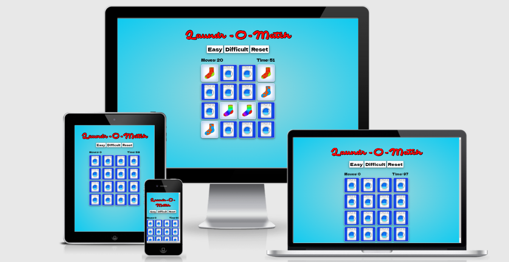
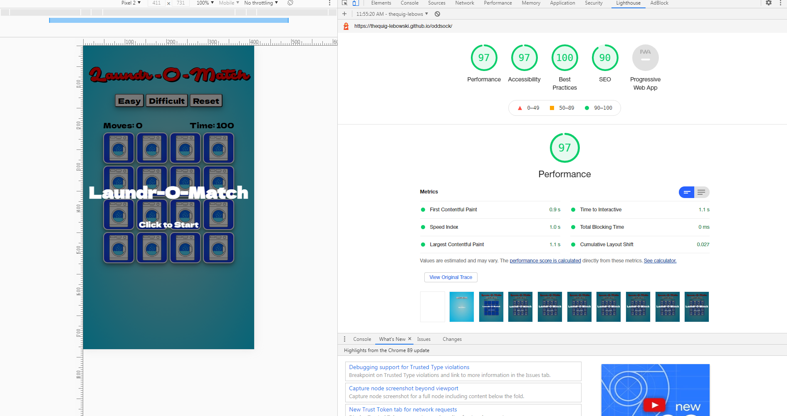
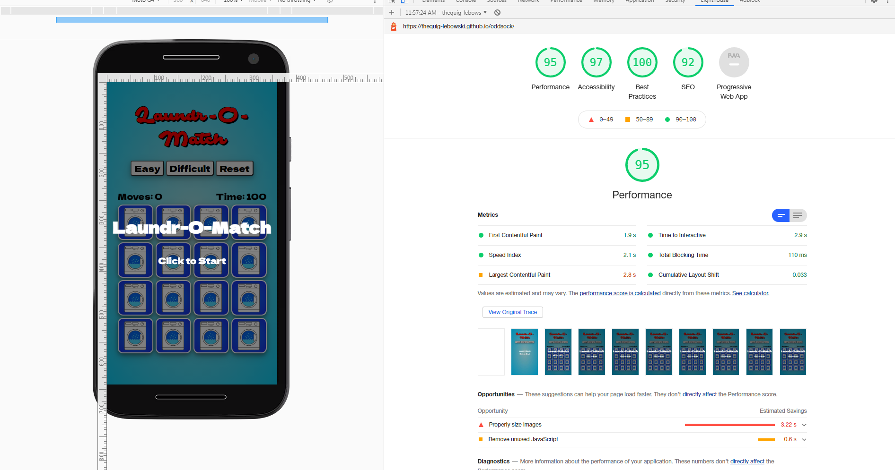

<br>
A simple memory game based around the usually mundane task of pairing washed socks. Set your difficulty level and challenge yourself to beat the clock or race against friends. It’s just a silly little bit of fun.

https://thequig-lebowski.github.io/oddsock/
<br>

# Table of Contents

1. [UX](#UX)
	* [Strategy](#Strategy) 
	* [Scope](#Scope)
	* [Structure](#Structure)
	* [Skeleton](#Skeleton)
	* [Surface](#Surface)
	* [User Stories](#User-Stories)
	* [Design](#Design)
2. [Features](#Features)
	* [Existing Features](#Existing-Features)
	* [Future Features](#Future-Features)
3. [Technologies Used](#Technologies-Used)
4. [Testing](#Testing)
	* [Testing User Stories](#Testing-User-Stories) 
	* [Unit Testing](#Unit-Testing)
	* [Device Testing](#Device-Testing)
	* [Validation](#Validation)
5. [Deployment](#Deployment)
6. [Credits](#Credits)
	* [Code](#Code)
	* [Images](#Images)

<br><br>

# UX

## Strategy
The primary objectives of this project are to have fun. This is a simple game that will hopefully engage and provide a bit of entertainment to the user. Played on a larger device such as an ipad, this game could be used to help develop hand eye coordination in young children as well help improve the memory skills of the user of any age.

## Scope
Bright, inviting graphics. Needs to be very intuitive. Card flipping based memory games are not new and therefore have an established gameplay. The user will likely have seen similar games or perhaps played an analogue version before, deviating from the expected workflow would be counterproductive and cause frustration among users, ultimately the exact opposite of what we’re looking for.
To accommodate a wider range of users the game will have multiple levels of difficulty; easy medium, hard and perhaps ‘insane’. Gameplay will be the same through out all of these levels, the only thing changing would be the size of the grid and number of cards on it.

## Structure
As this is not an overly complex concept or game, the visual elements should reflect that. Conesious of mobile users, I decided to have all the buttons above the game board to elemenate accidentally pressing any buttons. Similarily the start game and play again overlay screens were made to be clickable anywhere so any mobile users (especially those on larger devices) wouldn't have to awrkwardly navigate very far.

## Skeleton
Wireframes for the site
* [mobile](/assets/images/AssetsREADME/mobile_mockup.png)
* [desktop.](/assets/images/AssetsREADME/desktop_mockup.png)

There were several changes that were made since the mockups. Most obviously is the name of the site. I pivoted from Odd Sock to Laudr-O-Match halfway through development when I realised the opportunity for a bit of word play.
<br>
Another main difference was the ommision of some of the extra menu items. I had originally thought about adding a page for how to play the game as well as link but I thought it took away from the playfull nature I was aiming for with the site.
<br>
An issue that I felt was important to address was making sure that the users would be to tell where they were in the game: as you progress further the more cards you would have flipped over and the more important it was to highlight the last two cards clicked, to help differentiate them from the already flipped pairs of cards on the board.
<br>


## Surface
Colour Pallete, screen shots, theme

## User Stories
* As a user I want to play a fun game to pass the time
* As a user I want to develop my memory skills and reaction times
* As a user I want my young child to develop their hand-eye coordination 
* As a user I will look for feedback as to weather or not I am using the site/playing the game correctly.
* As the user I want to be able to play the game on my mobile device as well as desktop/laptop

## Design

Keeping with the theme of the laundromat I searched for a font that I felt matched the aesthetic for the main title and settled on Safir Script which I found [here](https://www.fontspace.com/safir-script-font-f24141), at Font Space. As that is quite a busy font I chose something slightly more simple but still complitmented it as the font for the remainder of the site. I landed on [this](https://fonts.google.com/specimen/Dela+Gothic+One), Dela Gothic font from Google Fonts.
<br>
I chose the colour pallete as I wanted to have a feel of soap bubbles and washing, but more of a cartoon-y style.
<br>
All the images of the socks for the faces of the cards I drew using photoshop and the image of the washing machine I used on the back was from [istockphoto.](https://www.istockphoto.com/vector/thin-line-washing-machine-with-blue-bubble-gm1140553709-305255556)
<br>
<br>

<br>
<br>

# Features
## Existing Features

* Welcom screen
<br>
Upon loading the page the user is presented with a screen explaining where they are, how to play the game and also an opportunity to click to start straight away.

* Level Select
<br>
Offering two modes of difficulty, a 6 X 6 square and a 8 X 8 square the user can choose which mode they would like to play in. Each level has a different time limit; 100 seconds for easey and 200 for difficult.

* Timer
<br> 
The game incorporates a timer counting down the sencond left before the game runs out. If the user hasn't managed to successfully find all the pairs fo socks before the timer runs out, the game is over and the user is offered sympathy and the chance to play again.

* Flip Counter
<br>
In addition to the timer, there is a move counter tallying each turn of the cards the player makes, incrementing it by one each time.

* Shuffle Algorithm
<br>
Critical to a card-based memory game is the ability to shuffle the cards each time the game is reset. To accomplish this I used the widely popular Fisher-Yates shuffle algorithm. This works by taking the last item from an array and swapping it with an item from a random position within the array from an idex position below it. It will do this for each index position until it reaches the first one [0].

* Flip Animation
<br>
To add to the experience of game play a flip animation was applied to each card whenever it was turned. This reinforced the idea that it was a cards that the user was playing with as well as providing a visual que that an input was recieved.
<br>

## Future Features

* Score To Beat
<br>
As eluded to in the wireframes I would have liked to have included some history of the users game play. Showing thier best score on a score board of tally card would've been a nice way to encourage users to improve and stay palying the game longer. Unfortuantely time didn't allow for this feature to be implemented on this rendition of the site.

* Share You Score
<br>
Another feature I would have liked to include would have been a 'Share' button on the Winner screen. Prompting the user to share thier experience and score on social media while possibly generating more traffic to the sire.

# Technologies Used

* HTML - The main structure and layout of the page
* CSS - The styling of the page
* JavaScript - used to dynamically control and generate new content
* JQuery Library - used as a shorthand for navigating the DOM
* Photoshop - All the images of the socks were created from scratch
* Tinypng.com - used to optimize the size and quality of the images
* VS Code - used as the enviroment to develop the project
* Github - used for version controll
* Github Pages - this project is currently hosted on Github Pages
* Google Fonts - used to style the main section of the game
* Lighthouse - used for testing the performance and accesibility of the site
* W3C Markup Validator - used to check the markup of the site and ensure there were no major errors.
<br>
<br>

# Testing
## Testing User Stories
* As a user I want to play a fun game to pass the time.
<br>
	-The game is engaging, simple and provides adequate challenge
<br>
<br>
* As a user I want to develop my memory skills and reaction times.
<br>
	-Providing two levels of difficulty a user has the scope to challenge themselves to improve using their time and score as a bar to beat.
<br>
<br>
* As a user I want my young child to develop their hand-eye coordination.
 	- Playing the game on a device such as an iPad or smartphone, a young child could indeed develop such dexterity.
<br>
<br>
* As a user I will look for feedback as to weather or not I am using the site/playing the game correctly.
	- Visual cues such as fliping the card to let the user know buttons have been clicke. Screen overlays when I run out of time/loose. Notifications when I win or the game is over.
<br>
<br>
* As the user I want to be able to play the game on my mobile device as well as desktop/laptop
<br>
	- The site is responsive and adapts well across multiply platforms.

<br>

## Unit Testing
Testing throughout development I encountered a few problems that needed to be sorted before I was able to continue.
* While writing the html code within the JS code that generated the correct number of divs for each level of dificulty I was using the incorrect file path to the images. I had used the file path from the .js file I was in rather than the .html file the the code would eventually be read from.
<br>

This:

``

Became:

``

* Unsatisfied with the spacing in the main title I added a span to style a single space between a dash and the 'O'.

* While testing I found that clicking the same card twice would produce a false win. I resolved this by adding the function `canFlipCard()` It checks to see if the card being clicked already has the `flipped` class attached to it and prevents it from flipping if it does. Later on I added another check, `gameBusy`, to prevent the user from clicking a card while an animation was running or the mis-matched cards hadn't reset yet.

* While manually testing I found that multiply instances of the `startTimer()` function where running at once. This I fixed by running and `if` statement inside the `setInterval()` function. The `if` checked a variable `canTime` for truthy every time it ran and would stop if it wasn't true. Elsewhere in the program the `canTime` variable was set to `false` when the timer was needed to stop. This solution works but I would like to find an alternative as this is prone to get out of hand on bigger projects as you need to rememeber to reset the varialbe to `true` every time.

* I had created and `overlay()` function to manage the overlay screens at the start and end of the games, however I found that it wouldn't reset the game consistantly.
I eventually removed this function completely and incorporated it into the `resetGame()` function.

* While trying to get the `resetGame()` function to work consistantly I struggled with a simple keyword.
`elm.remove(".visible");`
became this instead
`elm.classList.remove("visible");`


## Device Testing

<br>
<br>
The site was tested continously throughout development on both mobile, desktop and medium screens and adjusted accordingly.

## Validation

 Using the W3C validator I was made aware of a markup error. I had originally used the `<button>` ellements in which I then used a `<h3>` element to style the text within them. Although this worked for me the validator threw up an error saying that it was not possible to have a `<h3>` element as a child of a `<button>` element. I resolved this by removing them and replacing them with `<div>` elements instead and then adding some CSS stying to get them to match what I had originally.
 <br>
 <br>
 Using Lighthouse to check the performance and accesibility of the site.
 
 <br>
 <br>
 Running Lighthouse for mobile devices too

<br>
<br>

# Deployment
## GitHub Pages

The project was deployed to GitHub Pages using the following steps...

1. Log in to GitHub and locate the GitHub Repository
2. At the top of the Repository (not top of page), locate the "Settings" Button on the menu.
3. Scroll down the Settings page until you locate the "GitHub Pages" Section.
4. Under "Source", click the dropdown called "None" and select "Master Branch".
5. The page will automatically refresh.
6. Scroll back down through the page to locate the now published site link in the "GitHub Pages" section.

## Forking the GitHub Repository

By forking the GitHub Repository we make a copy of the original repository on our GitHub account to view and/or make changes without affecting the original repository by using the following steps...

1. Log in to GitHub and locate the GitHub Repository
2. At the top of the Repository (not top of page) just above the "Settings" Button on the menu, locate the "Fork" Button.
3. You should now have a copy of the original repository in your GitHub account.

## Making a Local Clone

1. Log in to GitHub and locate the GitHub Repository.
2. Under the repository name, click "Clone or download".
3. To clone the repository using HTTPS, under "Clone with HTTPS", copy the link.
4. Open Git Bash
5. Change the current working directory to the location where you want the cloned directory to be made.
6. Type `git clone`, and then paste the URL you copied in Step 3.

```
$ git clone https://github.com/YOUR-USERNAME/YOUR-REPOSITORY
```

7. Press Enter. Your local clone will be created.

```
$ git clone https://github.com/YOUR-USERNAME/YOUR-REPOSITORY
> Cloning into `CI-Clone`...
> remote: Counting objects: 10, done.
> remote: Compressing objects: 100% (8/8), done.
> remove: Total 10 (delta 1), reused 10 (delta 1)
> Unpacking objects: 100% (10/10), done.
```
<br>

# Credits
## Code
The majority of this projuect is the culmination of the study I've done with Code Institute, but for the rest I've listed below.
* Help with generating even, dynamic grids was taken from [these](https://developer.mozilla.org/en-US/docs/Web/CSS/grid-template-columns) examples on MDN Web Docs.
* Additional info on making the font size dynamic was taken from [w3schools](https://www.w3schools.com/howto/howto_css_responsive_text.asp) and [this](https://stackoverflow.com/questions/40528290/how-to-implement-max-font-size) stack overflow thread.
* [CSS Tricks](https://css-tricks.com/adding-stroke-to-web-text/) had what I needed to get a simulated stroke outline on the main title (it's actually a shadow).
* Crutialy, in order to re-flip the cards I needed to know the `.contains()` method. [Here](https://www.javascripttutorial.net/dom/css/check-if-an-element-contains-a-class/) is where I found that.
* [Stack Overflow](https://stackoverflow.com/questions/5978519/how-to-use-setinterval-and-clearinterval) to the resue again, this time for clarity on the `setInterval()` function to run the timmer.
* To animate the overlays in I used [this](https://www.codegrepper.com/code-examples/css/animation+fade+in+css) piece of CSS.
* Finally, the shuffle algorithm which took a minute to get my head around was in part, due to [this](https://stackoverflow.com/questions/2450954/how-to-randomize-shuffle-a-javascript-array/2450976#2450976) Stack Overflow thread.
## Images
All the images of socks where created by me except for the [washing machine](https://www.istockphoto.com/vector/thin-line-washing-machine-with-blue-bubble-gm1140553709-305255556) which I got from istockphotos.
